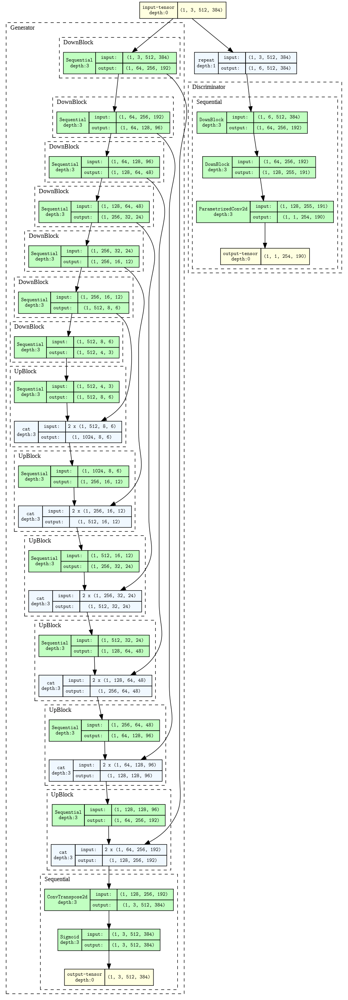

# Image Colorization with Neural Networks - Training scripts

> A deep learning application that colorizes grayscale images, deployed on Kubernetes with a full CI/CD pipeline.

---

| **Live Demo** |
| :---:|
| [**https://colorization.dyn.cloud.e-infra.cz/**](https://colorization.dyn.cloud.e-infra.cz/) |

## 🌟 Project Overview
I wanted this project to be complete, end-to-end process which goes beyond just training a deep learning model. The goal is to bring the model to user-facing frontend in a scalable and devops-focused way. It takes a grayscale image from a user, uses a Conditional Generative Adversarial Network (cGAN) to add realistic color, and returns the result. The entire system is containerized and deployed on a public Kubernetes cluster using Helm, with automated builds and deployments managed by GitHub Actions.

## 🧠 The Machine Learning Model

I was following the protocol proposed in the [Pix2Pix paper](https://arxiv.org/abs/1611.07004) for training the Conditional GAN model. The architecture consists of a U-Net generator and a PatchGAN discriminator.

- **Generator:** U-Net architecture with skip connections tasked with generating detailed images.
- **Discriminator:** PatchGAN classifier that determines if `(input, output)` pairs are real or fake.
- **Dataset:** Trained on a 10,000-image subset of the COCO dataset.
- **[https://github.com/vojtam/cGAN-image-colorization](#ML-project-repository)**

## 📂 Project Repositories
This project is split into four repositories, each with a specific responsibility:

| Repository | Description | Link |
| :--- | :--- | :---: |
| 🎨 **Frontend** | SvelteKit user interface. | [image-colorizer-frontend](https://github.com/vojtam/colorization-frontend) |
| 🚀 **Backend** | FastAPI application handling API requests. | [image-colorizer-backend](https://github.com/vojtam/colorization-backend) |
| 🧠 **Model Training**| Scripts, notebooks, and code for training the cGAN model. | **(This Repository)** |
| ⚙️ **Infrastructure**| Kubernetes manifests, Helm charts, and CI/CD workflows. | [image-colorizer-infra](https://github.com/vojtam/colorization-helm-manifests) |
